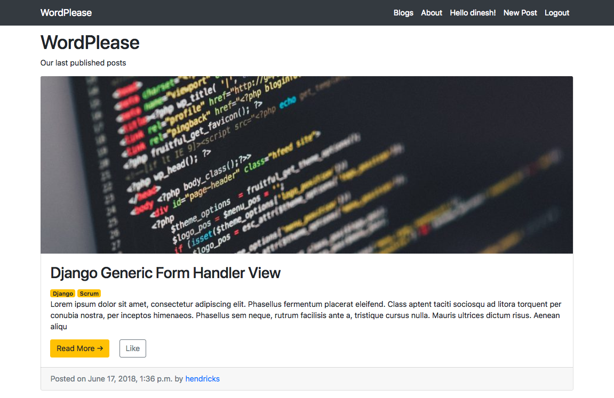
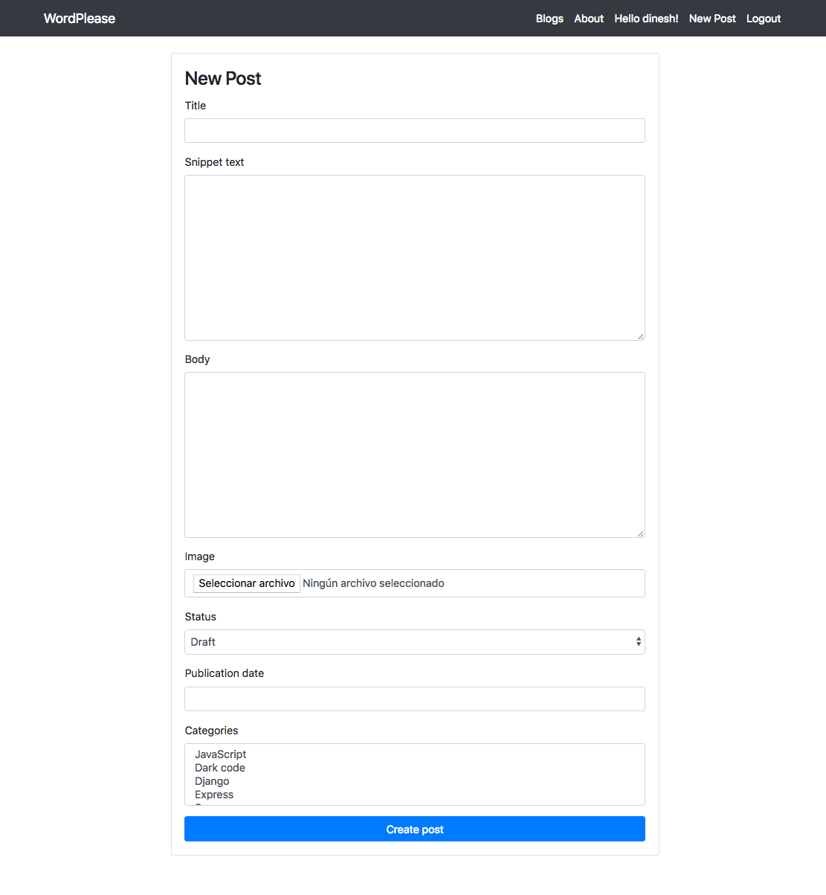
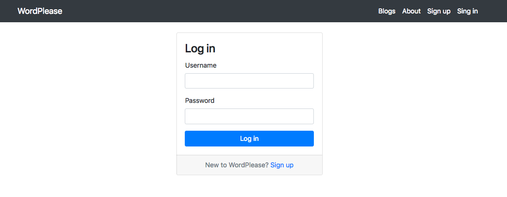
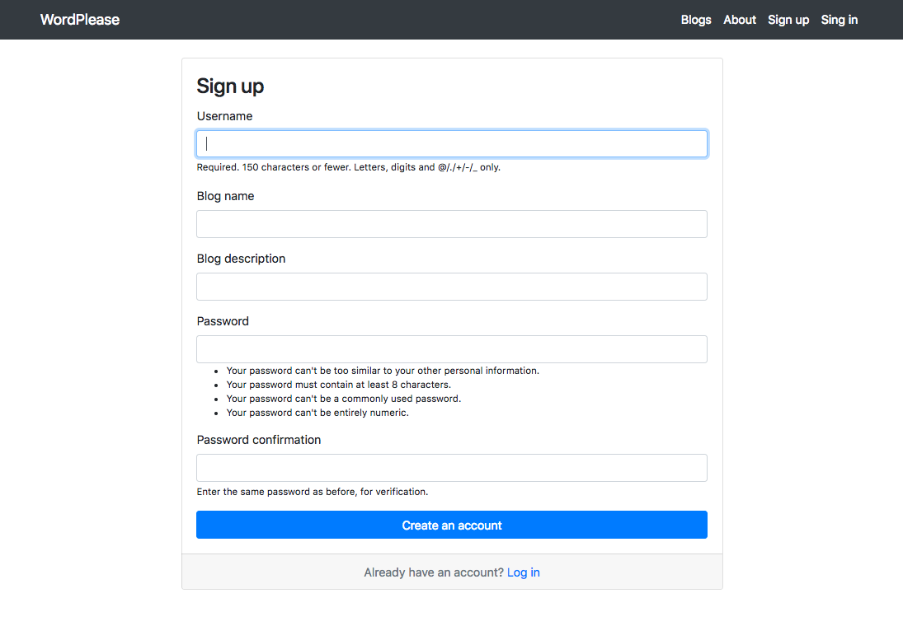

# WordPlease 0.1

A simple blogging platform to learn Django

## Installation
This app was developed with Django. To install and test it you have to follow the following steps:

### Clone this repo:

`git clone https://github.com/ajmasia/wordplease.git`

### Setup the local configurations

`virtualenv env`

`source env/bin/activate`

### Install teh requirements:
`pip install -r requirements.txt`

### Create data base
`python manage.py migrate`

### Create super user
`python manage.py createsuperuser`

### Run server
`python manage.py runserver`

## Ho to play with WordPlease

| Feature | URL | Note |
| ------- | --- | ---- |
| Sign up | `/signup/` | To register new user|
| Log in | `/login/` | Account log in |
| User blog | `/blogs/<username>` | User published posts |
| Post detail | `/blogs/<username>/<post_id>` | Access to post detail |
| WordPlease home | `/` | Access to all users published posts |
| Create new post | `/new-post/` | You need to be logged |
| Admin panel | `/admin/` | Login with super admin user |
| Categories admin panel | `admin/categories/category/` | Admin blog categories |
| Logout | `/logout/` | WordPlease logout |

### WordPlease API REST

### Users

| Method | Result | URL |
| ------ | ------ | --- |
| GET | Users list | `/api/v1/users/` |
| POST | Sign up | `/api/v1/users/`
| GET | User detail | `/api/v1/users/<user_id>` |
| PUT | User update | `/api/v1/users/<user_id>` |
| DELETE | User delete | `/api/v1/users/<user_id>` |

### Posts
| Method | Result | URL |
| ------ | ------ | --- |
| GET | Posts list | `/api/v1/posts/` |
| POST | New post | `/api/v1/posts/`
| GET | Post detail | `/api/v1/posts/<user_id>` |
| PUT | Post update | `/api/v1/posts/<user_id>` |
| DELETE | Post delete | `/api/v1/posts/<user_id>` |
| GET | Blogs list | `api/v1/blogs/` | 

## Some images

### Posts list

### New post form

### Sign up form

### Log in form

 ## License
 MIT License

Copyright (c) 2018 Antonio José Masiá

Permission is hereby granted, free of charge, to any person obtaining a copy of this software and associated documentation files (the "Software"), to deal in the Software without restriction, including without limitation the rights to use, copy, modify, merge, publish, distribute, sublicense, and/or sell copies of the Software, and to permit persons to whom the Software is furnished to do so, subject to the following conditions:

The above copyright notice and this permission notice shall be included in all copies or substantial portions of the Software.

THE SOFTWARE IS PROVIDED "AS IS", WITHOUT WARRANTY OF ANY KIND, EXPRESS OR IMPLIED, INCLUDING BUT NOT LIMITED TO THE WARRANTIES OF MERCHANTABILITY, FITNESS FOR A PARTICULAR PURPOSE AND NONINFRINGEMENT. IN NO EVENT SHALL THE AUTHORS OR COPYRIGHT HOLDERS BE LIABLE FOR ANY CLAIM, DAMAGES OR OTHER LIABILITY, WHETHER IN AN ACTION OF CONTRACT, TORT OR OTHERWISE, ARISING FROM, OUT OF OR IN CONNECTION WITH THE SOFTWARE OR THE USE OR OTHER DEALINGS IN THE SOFTWARE.